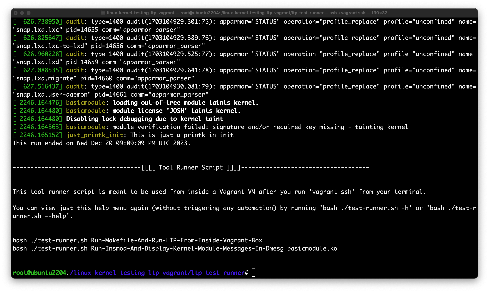

# linux-kernel-testing-ltp-vagrant

This experiment is a simple [LTP](https://github.com/linux-test-project) proof-of-concept project combined with [Vagrant](https://developer.hashicorp.com/vagrant/install) and [Virtualbox](https://www.virtualbox.org/). You may be wondering "Why virtual machines and not Docker containers?". Kernel development requires both the operating system kernel and the application layer, and [a virtual machine is capable of containing both](https://www.freecodecamp.org/news/docker-vs-vm-key-differences-you-should-know/). [Docker containers](https://www.docker.com/resources/what-container/) and other similar tools (Podman etc.) only virtualize the application layer, they lack a Hypervisor, and do not have access to an operating system kernel. 

In the future, I may revisit this and add a few more things. This was originally created on a Macbook. Assuming that you know how to use [Homebrew](https://brew.sh/) here are some useful commands to help get started quickly. 

```
brew install --cask virtualbox
brew install --cask vagrant
brew install --cask vagrant-manager
```

After running the install commands above you can run the following from the root of this repo (same directory as the provided `Vagrantfile`. 

`WARNING: Running this Vagrantfile for the first time will result in build times of almost 20 minutes or more depending on the specifications of your hardware. This is one of the hard parts of working with the LTP project.`

```
vagrant up
vagrant ssh
cd /linux-kernel-testing-ltp-vagrant/ltp-test-runner
bash ./test-runner.sh --help    ## >> Follow the instructions in the help menu << ##
```

After running the `bash ./test-runner.sh` commands, you should see output from your terminal similar to the screenshot below.

